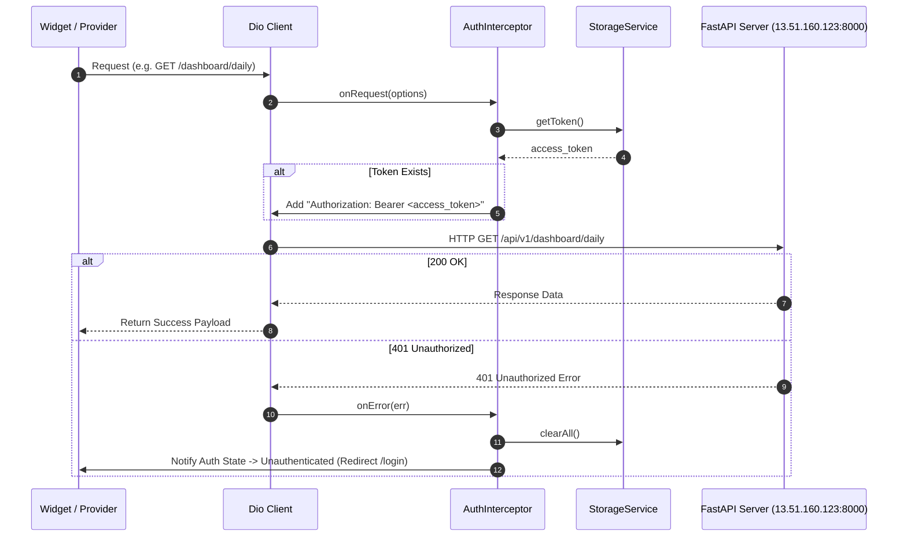

# Feature Specification: Core Architecture & Data Foundation

**Feature Branch**: `feature/01-core-architecture-and-data-foundation`  
**Specification Path**: `specs/01_core_architecture_and_data_foundation.md`  
**Target Milestone**: Phase 1 - Core Architecture & Data Foundation  

---

## 1. Overview & Goal

The **Core Architecture & Data Foundation** establishes the core infrastructure, networking, token management, error handling, and data transfer objects (DTOs) for the entire **Bite Frontend** Flutter application.

Specifically, Phase 1 delivers:

1. **Local Storage & Token Persistence**:
   - Implement `StorageService` for persisting `access_token`, `user_id`, `email`, and `display_name` securely using `flutter_secure_storage` or key-value storage.
   - Support token lifecycle operations: `saveToken`, `getToken`, `clearToken`, `saveUserData`, `getUserData`, `clearAll`.
2. **Centralized Dio Networking & Auth Interceptor**:
   - Configure `Dio` instance targeting base URL `http://13.51.160.123:8000/api/v1` with 15-second connect/receive timeouts.
   - Implement `AuthInterceptor` to automatically inject `Authorization: Bearer <access_token>` into protected API requests.
   - Handle `401 Unauthorized` responses by wiping local token storage and triggering unauthenticated state transitions.
3. **Comprehensive Core Data Models & DTO Schemas**:
   - Define serializable Dart model classes with `fromJson` / `toJson` for all API endpoints across Auth, Profile, Meals, Dashboard, and Chat features based on [`api_docs.md`](file:///home/jiggra/BiteFrontEnd/api_docs.md).
4. **App Error & Failure Domain**:
   - Standardize application error types: `Failure` hierarchy (`ServerFailure`, `NetworkFailure`, `CacheFailure`, `UnauthorizedFailure`) and custom `Exception` types.

---

## 2. API & Data Contracts

### 2.1 Base Configuration
* **Public FastAPI Base URL**: `http://13.51.160.123:8000/api/v1` (configured via `ApiConstants.baseUrl`)
* **Interactive Docs URL**: `http://13.51.160.123:8000/docs`
* **Default Headers**:
  - `Content-Type: application/json`
  - `Accept: application/json`
  - Authenticated requests: `Authorization: Bearer <access_token>`
  - Multipart upload requests: `Content-Type: multipart/form-data`
  - Chat SSE stream requests: `Accept: text/event-stream`

---

### 2.2 Complete DTO Schemas (`api_docs.md`)

#### 1. Authentication & Dev Token Models
* **`LoginRequest`**:
  - `email` (`String`, required)
  - `password` (`String`, required)
* **`RegisterRequest`**:
  - `email` (`String`, required)
  - `password` (`String`, required)
  - `display_name` (`String`, required)
  - `age` (`int`, required)
  - `height_cm` (`double`, required)
  - `weight_kg` (`double`, required)
  - `gender` (`String`, required: `male` | `female` | `other`)
  - `activity_level` (`String`, required: `sedentary` | `light` | `moderate` | `active` | `very_active`)
  - `primary_goal` (`String`, required: `weight_loss` | `maintenance` | `muscle_gain`)
* **`DevTokenRequest`**:
  - `email` (`String`, required)
  - `user_id` (`String?`, optional UUID)
* **`AuthResponse`**:
  - `access_token` (`String`, required)
  - `token_type` (`String`, required - e.g. `"bearer"`)
  - `expires_in` (`int`, required - e.g. `86400`)
  - `user_id` (`String`, required UUID)
  - `email` (`String`, required)
  - `display_name` (`String?`, optional)
  - `age` (`int?`, optional)
  - `height_cm` (`double?`, optional)
  - `weight_kg` (`double?`, optional)
  - `gender` (`String?`, optional)
  - `bmr` (`double?`, optional)
  - `tdee` (`double?`, optional)
  - `target_calories` (`double?`, optional)

#### 2. User Profile Models
* **`UserProfileResponse`**:
  - `id` (`String`, required UUID)
  - `display_name` (`String`, required)
  - `height_cm` (`double`, required)
  - `weight_kg` (`double`, required)
  - `age` (`int`, required)
  - `gender` (`String`, required)
  - `activity_level` (`String`, required)
  - `primary_goal` (`String`, required)
  - `bmr` (`double`, required)
  - `tdee` (`double`, required)
  - `target_calories` (`double`, required)
  - `target_protein_g` (`double`, required)
  - `target_carbs_g` (`double`, required)
  - `target_fat_g` (`double`, required)
  - `target_micronutrients` (`Map<String, dynamic>`, required)
* **`UserProfileUpdate`**:
  - `display_name` (`String?`)
  - `height_cm` (`double?`)
  - `weight_kg` (`double?`)
  - `age` (`int?`)
  - `gender` (`String?`)
  - `activity_level` (`String?`)
  - `primary_goal` (`String?`)

#### 3. Daily Dashboard & History Models
* **`DailyDashboardResponse`**:
  - `date` (`String`, YYYY-MM-DD)
  - `target_calories` (`double`)
  - `consumed_calories` (`double`)
  - `remaining_calories` (`double`)
  - `protein` (`MacroProgress`)
  - `carbs` (`MacroProgress`)
  - `fat` (`MacroProgress`)
  - `meals` (`List<LoggedMealSummary>`)
  - `top_micronutrients` (`Map<String, double>`)
* **`MacroProgress`**:
  - `target` (`double`)
  - `consumed` (`double`)
  - `remaining` (`double`)
* **`LoggedMealSummary`**:
  - `meal_id` (`String` UUID)
  - `meal_type` (`String`: `breakfast` | `lunch` | `dinner` | `snack`)
  - `user_caption` (`String?`)
  - `image_url` (`String?`)
  - `calories` (`double`)
  - `protein_g` (`double`)
  - `carbs_g` (`double`)
  - `fat_g` (`double`)
  - `logged_at` (`String` timestamp)
* **`HistoricalAnalyticsResponse`**:
  - `user_id` (`String` UUID)
  - `total_days_logged` (`int`)
  - `history` (`List<DailyHistoryItem>`)
* **`DailyHistoryItem`**:
  - `date` (`String`)
  - `meal_count` (`int`)
  - `total_calories` (`double`)
  - `target_calories` (`double`)
  - `total_protein_g` (`double`)
  - `target_protein_g` (`double`)
  - `total_carbs_g` (`double`)
  - `target_carbs_g` (`double`)
  - `total_fat_g` (`double`)
  - `target_fat_g` (`double`)
  - `goal_status` (`String`: `under` | `on_target` | `over`)

#### 4. Multimodal Meal Ingestion Models
* **`MealAnalyzeRequest`**:
  - `image_url` (`String?`)
  - `user_caption` (`String?`)
  - `meal_type` (`String?`)
* **`MealAnalysisResponse`**:
  - `detected_items` (`List<DetectedItem>`)
  - `meal_type` (`String`)
  - `meal_type_source` (`String`)
  - `total_calories` (`double`)
  - `total_protein_g` (`double`)
  - `total_carbs_g` (`double`)
  - `total_fat_g` (`double`)
  - `aggregated_nutrients` (`Map<String, double>`)
  - `confidence_score` (`double`)
  - `warnings` (`List<String>`)
* **`DetectedItem`**:
  - `food_name` (`String`)
  - `fdc_id` (`int?`)
  - `portion_amount` (`double`)
  - `portion_unit` (`String`)
  - `gram_weight` (`double`)
  - `calories` (`double`)
  - `protein_g` (`double`)
  - `carbs_g` (`double`)
  - `fat_g` (`double`)
  - `is_fallback` (`bool`)
  - `raw_usda_nutrients` (`Map<String, dynamic>`)
* **`MealConfirmRequest`**:
  - `meal_type` (`String`)
  - `user_caption` (`String?`)
  - `image_url` (`String?`)
  - `items` (`List<DetectedItem>`)
* **`MealConfirmResponse`**:
  - `meal_id` (`String` UUID)
  - `user_id` (`String` UUID)
  - `logged_at` (`String` timestamp)
  - `meal_type` (`String`)
  - `total_calories` (`double`)
  - `total_protein_g` (`double`)
  - `total_carbs_g` (`double`)
  - `total_fat_g` (`double`)
  - `item_count` (`int`)

#### 5. Chat & SSE Models
* **`ChatRequest`**:
  - `message` (`String`)
  - `conversation_id` (`String?`)
  - `client_timezone` (`String?`)
* **`ChatSessionResponse`**:
  - `id` (`String` UUID)
  - `user_id` (`String` UUID)
  - `title` (`String`)
  - `created_at` (`String`)
  - `updated_at` (`String`)
  - `message_count` (`int`)
* **`CreateSessionRequest`**:
  - `title` (`String`)
* **`ChatMessageResponse`**:
  - `id` (`String` UUID)
  - `session_id` (`String` UUID)
  - `role` (`String`: `user` | `assistant` | `system`)
  - `content` (`String`)
  - `created_at` (`String`)

---

## 3. Layered Architecture Breakdown

```text
lib/
├── core/
│   ├── constants/
│   │   ├── api_constants.dart          # Base URL, endpoint paths, timeouts
│   │   └── storage_constants.dart      # Storage key constants
│   ├── errors/
│   │   ├── failure.dart                # Application Failure domain classes
│   │   └── exception.dart              # Custom network & storage exceptions
│   ├── network/
│   │   ├── dio_provider.dart           # Centralized Riverpod Dio provider & interceptors
│   │   └── auth_interceptor.dart       # Bearer token injection & 401 handling interceptor
│   ├── router/
│   │   └── app_router.dart             # GoRouter setup & auth redirect logic
│   ├── theme/
│   │   ├── app_theme.dart              # Material 3 light/dark themes
│   │   └── app_colors.dart             # Project color palette
│   └── utils/
│       ├── storage_service.dart        # Secure storage for JWT & session metadata
│       └── formatters.dart             # Date and macro metric display formatters
└── features/
    ├── auth/
    │   └── data/
    │       └── models/                 # LoginRequest, RegisterRequest, DevTokenRequest, AuthResponse
    ├── dashboard/
    │   └── data/
    │       └── models/                 # DailyDashboardResponse, MacroProgress, HistoricalAnalyticsResponse
    ├── meals/
    │   └── data/
    │       └── models/                 # MealAnalyzeRequest, MealAnalysisResponse, MealConfirmRequest/Response
    ├── chat/
    │   └── data/
    │       └── models/                 # ChatRequest, ChatSessionResponse, ChatMessageResponse
    └── profile/
        └── data/
            └── models/                 # UserProfileResponse, UserProfileUpdate
```

---

## 4. State Management & Data Flow

### 4.1 Dependency Injection Hierarchy (Riverpod)

```text
StorageService (Token & User metadata persistence)
       │
       ▼
storageServiceProvider
       │
       ▼
authInterceptorProvider ──► dioProvider (Configured Dio with Base URL & Auth Headers)
       │                         │
       ▼                         ▼
authRepositoryProvider ◄── authRemoteDataSourceProvider
       │
       ▼
authNotifierProvider (AsyncValue<UserEntity?>)
```

### 4.2 AuthInterceptor Request/Response Lifecycle



---

## 5. UI & Theme Guidelines

- **Design System Rules**: Centralize all color definitions, font styles (`GoogleFonts.inter`), and spacing within `AppTheme` / `AppColors`.
- **Material 3 Integration**: Enable `useMaterial3: true`, dark/light theme switching based on system preferences.
- **Loading & Error Feedback**: Standardized error banners (`ScaffoldMessenger`) and responsive shimmers/spinners for loading states.

---

## 6. Testing & Verification Checklist

### 6.1 Unit Tests
- [ ] `StorageServiceTest`: Test storing, retrieving, and wiping JWT `access_token` and user data.
- [ ] `AuthInterceptorTest`:
  - Verify `Authorization` header is attached when token is saved.
  - Verify request proceeds without header when token is null.
  - Verify 401 status response triggers `StorageService.clearAll()` and invalidates session.
- [ ] `DTO Serialization Tests`:
  - Verify `AuthResponse.fromJson` / `toJson` against sample payloads from `api_docs.md`.
  - Verify `DailyDashboardResponse.fromJson` / `toJson`.
  - Verify `MealAnalysisResponse.fromJson` / `toJson`.
  - Verify `ChatSessionResponse.fromJson` / `toJson`.
  - Verify `UserProfileResponse.fromJson` / `toJson`.

### 6.2 Static Analysis & Formatting Commands
```bash
# 1. Format code
dart format .

# 2. Run static analysis
flutter analyze

# 3. Execute unit tests
flutter test test/core/
```
