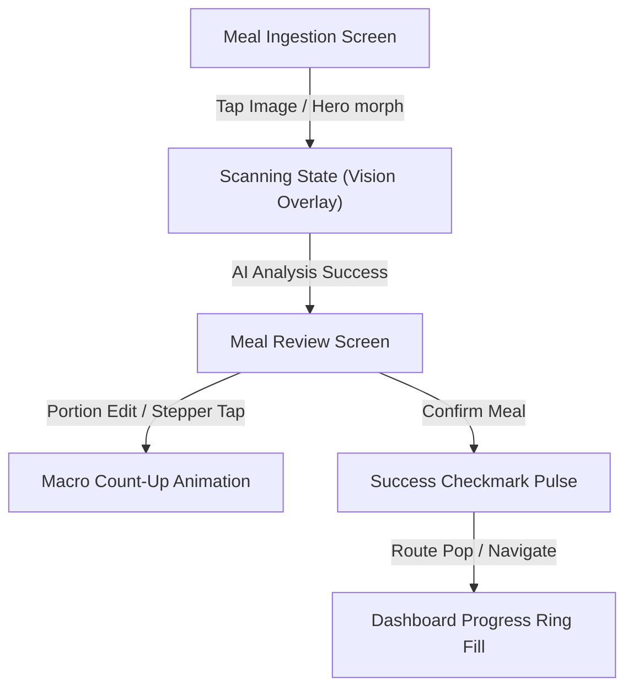

# Feature Specification: Multimodal Meal Ingestion & Vision Analysis

* **Task Name**: 04 Multimodal Meal Ingestions and Vision Analysis
* **Branch**: `feature/04-multimodal-meal-ingestion-and-vision-analysis`
* **Specification File**: `specs/04_multimodal_meal_ingestion_and_vision_analysis.md`
* **Base API Path**: `http://13.51.160.123:8000/api/v1/meals`
* **Design Reference**: [Figma Food App Template](https://www.figma.com/design/mBcFjXX6td7789R2bmxg9J/Food-App-Design-UI-Template--Community-?node-id=0-1&t=wFrkBDvTZKdmIH6v-1) (Emerald Accent `#10B981`, Inter Typography, Soft Shadows, Rounded Cards)

---

## 1. Overview & Goal

The **Multimodal Meal Ingestion & Vision Analysis** feature enables users to log meals seamlessly using AI Vision, textual captions, or direct camera captures. Users can take a photo of their meal, upload an image from the device gallery, or type a freeform textual description (e.g., *"2 bananas with 1 cup of whole milk"*).

The backend processes the multimodal input via `gpt-4o-mini`, resolves food items against USDA FoodData Central (FDC), calculates total calories and macronutrients (protein, carbs, fat), auto-infers the meal category (`breakfast`, `lunch`, `dinner`, `snack`), and returns a structured response with itemized macro breakdowns and micronutrients.

### Key Objectives
1. **Multimodal Data Capture**: Support camera capture, image selection from gallery, and freeform text caption input.
2. **Dual-Mode API Support**: Support both `multipart/form-data` (binary image upload) and `application/json` (`image_url` + `user_caption`) HTTP payloads.
3. **Interactive Analysis Review**: Render an itemized review screen allowing users to adjust detected items (portion amount, unit), add missing items manually, or delete misidentified items with real-time macro recalculations.
4. **Fluid Motion & Micro-Interactions**: Incorporate fluid Apple-grade animations—hero image transitions, scanning pulse overlays, macro count-up interpolations, item list collapse/expansion, and spring button feedback.
5. **Atomic Meal Confirmation**: Persist confirmed meal logs to the database (`POST /meals/confirm`) and automatically refresh the daily dashboard state so macro progress rings update immediately.

---

## 2. API & Data Contracts

Based on [Bite API Specification](file:///home/jiggra/BiteFrontEnd/api_docs.md):

### 2.1 Multimodal Food Vision Analysis (`POST /api/v1/meals/analyze`)

* **Auth**: HTTP Bearer Token (`Authorization: Bearer <token>`)
* **Headers**: `Content-Type: multipart/form-data` OR `Content-Type: application/json`

#### Request Payload A: JSON (`MealAnalyzeRequestModel`)
```json
{
  "image_url": "https://example.com/food.jpg",
  "user_caption": "2 bananas with 1 cup milk",
  "meal_type": "breakfast"
}
```

#### Request Payload B: Multipart Form Data
* `file`: Binary image file upload (`image/jpeg` or `image/png`, max 10MB)
* `user_caption`: (Optional string)
* `meal_type`: (Optional string enum: `breakfast`, `lunch`, `dinner`, `snack`)

#### Response (`MealAnalysisResponseModel` - `200 OK`)
```json
{
  "detected_items": [
    {
      "food_name": "Banana",
      "fdc_id": 2012128,
      "portion_amount": 2.0,
      "portion_unit": "medium banana",
      "gram_weight": 236.0,
      "calories": 210.04,
      "protein_g": 2.57,
      "carbs_g": 53.81,
      "fat_g": 0.78,
      "is_fallback": false,
      "raw_usda_nutrients": {
        "Fiber, total dietary (g)": 6.14,
        "Total Sugars (g)": 28.86
      }
    }
  ],
  "meal_type": "breakfast",
  "meal_type_source": "caption_explicit",
  "total_calories": 210.04,
  "total_protein_g": 2.57,
  "total_carbs_g": 53.81,
  "total_fat_g": 0.78,
  "aggregated_nutrients": {
    "Fiber, total dietary (g)": 6.14,
    "Total Sugars (g)": 28.86
  },
  "confidence_score": 1.0,
  "warnings": []
}
```

---

### 2.2 Confirm & Persist Meal Log (`POST /api/v1/meals/confirm`)

* **Auth**: HTTP Bearer Token (`Authorization: Bearer <token>`)
* **Content-Type**: `application/json`

#### Request Payload (`MealConfirmRequestModel`)
```json
{
  "meal_type": "breakfast",
  "user_caption": "2 bananas breakfast",
  "image_url": "https://example.com/food.jpg",
  "items": [
    {
      "food_name": "Banana",
      "fdc_id": 2012128,
      "portion_amount": 2.0,
      "portion_unit": "medium banana",
      "gram_weight": 236.0,
      "calories": 210.04,
      "protein_g": 2.57,
      "carbs_g": 53.81,
      "fat_g": 0.78,
      "is_fallback": false,
      "raw_usda_nutrients": {}
    }
  ]
}
```

#### Response (`MealConfirmResponseModel` - `201 Created`)
```json
{
  "meal_id": "c1f7b8e0-1234-4567-89ab-cdef01234567",
  "user_id": "3fa85f64-5717-4562-b3fc-2c963f66afa6",
  "logged_at": "2026-08-25 10:30:00+00",
  "meal_type": "breakfast",
  "total_calories": 210.04,
  "total_protein_g": 2.57,
  "total_carbs_g": 53.81,
  "total_fat_g": 0.78,
  "item_count": 1
}
```

---

## 3. Layered Architecture Breakdown

Following the project's Lightweight Clean Architecture & Riverpod conventions (`lib/features/meals/`):

```text
lib/features/meals/
├── data/
│   ├── datasources/
│   │   └── meals_remote_data_source.dart      # Dio HTTP client for /meals/analyze & /meals/confirm
│   ├── models/
│   │   ├── meal_analysis_response_model.dart  # DetectedItemModel & MealAnalysisResponseModel
│   │   ├── meal_confirm_request_model.dart   # MealConfirmRequestModel DTO
│   │   └── meal_confirm_response_model.dart  # MealConfirmResponseModel DTO
│   └── repositories/
│       └── meals_repository.dart              # Repository mapping Dio response & exception handling
├── presentation/
│   ├── providers/
│   │   ├── meal_analysis_notifier.dart        # Notifier managing state, portion scaling, item edit logic
│   │   └── meal_providers.dart                # Riverpod providers for Repository & DataSource
│   ├── screens/
│   │   ├── meal_ingestion_screen.dart         # Main entry screen: Photo upload, camera, caption, meal type
│   │   └── meal_review_screen.dart            # Review screen: Animated items list, portion editor, totals
│   └── widgets/
│       ├── camera_preview_card.dart           # Selected image card with hero animation & camera launch
│       ├── vision_scanning_overlay.dart       # Laser/pulse vision scanning radar during AI analysis
│       ├── detected_item_card.dart            # Food item card with quantity stepper micro-interactions
│       ├── add_item_dialog.dart               # Dialog to manually search/add food items
│       ├── meal_type_selector.dart            # Animated pill choice selector (Breakfast, Lunch, etc.)
│       └── macro_summary_bar.dart             # Animated count-up macro summary banner (Calories, P, C, F)
```

---

## 4. State Management Design

### 4.1 State Class (`MealAnalysisState`)

```dart
enum MealAnalysisStatus { initial, analyzing, review, committing, success, failure }

class MealAnalysisState {
  final MealAnalysisStatus status;
  final String? selectedImagePath;
  final String? imageUrl;
  final String userCaption;
  final String selectedMealType; // 'breakfast', 'lunch', 'dinner', 'snack'
  final List<DetectedItemModel> items;
  final String? errorMessage;
  final MealConfirmResponseModel? lastConfirmedMeal;

  const MealAnalysisState({
    this.status = MealAnalysisStatus.initial,
    this.selectedImagePath,
    this.imageUrl,
    this.userCaption = '',
    this.selectedMealType = 'snack',
    this.items = const [],
    this.errorMessage,
    this.lastConfirmedMeal,
  });

  // Derived calculations
  double get totalCalories => items.fold(0.0, (sum, i) => sum + i.calories);
  double get totalProtein => items.fold(0.0, (sum, i) => sum + i.proteinG);
  double get totalCarbs => items.fold(0.0, (sum, i) => sum + i.carbsG);
  double get totalFat => items.fold(0.0, (sum, i) => sum + i.fatG);
}
```

### 4.2 Notifier Logic (`MealAnalysisNotifier`)

- `selectImage(String path)`: Sets `selectedImagePath` and resets error state.
- `updateCaption(String caption)`: Sets `userCaption`.
- `selectMealType(String type)`: Updates `selectedMealType`.
- `analyzeMeal()`: Triggers API vision request (`POST /meals/analyze`). Sets status to `analyzing`, then `review` on success.
- `updateItemPortion(int index, double newAmount)`: Scales item calories and macros proportionally to `newAmount / oldAmount`.
- `removeItem(int index)`: Removes item with soft animation triggering total recalculation.
- `addItem(DetectedItemModel item)`: Appends custom food item.
- `confirmMeal()`: Sends `POST /meals/confirm`. On success, sets status to `success` and executes `ref.invalidate(dailyDashboardProvider)` to refresh dashboard macros.

---

## 5. UI & Responsive Design System Integration

Following [DESIGN_REFERENCE.md](file:///home/jiggra/BiteFrontEnd/DESIGN_REFERENCE.md):

* **Color Palette**:
  * Primary Accent: Emerald Green `#10B981` (`AppColors.primary`)
  * Surface Dark/Light: `#121826` / `#F8FAFC`
  * Macro Accent Colors: Protein (`#3B82F6` Blue), Carbs (`#F59E0B` Amber), Fat (`#EC4899` Pink)
* **Typography**: `GoogleFonts.inter` with distinct font weights (600 bold headers, 500 medium labels).
* **Shape & Elevation**: `AppRadius.lg` (16px rounded corners), subtle border strokes (`AppColors.neutral200`), soft drop shadows.

---

## 6. Comprehensive Motion & Animation Specs

Following [flutter-build-animations skill](file:///home/jiggra/BiteFrontEnd/.agents/skills/flutter-build-animations/SKILL.md) and Emil Kowalski UI polish guidelines:



### 6.1 Hero Image Shared-Element Transition
* **Trigger**: Navigating from `MealIngestionScreen` preview card to `MealReviewScreen`.
* **Implementation**: Wrap the food image thumbnail in a `Hero` widget with matching tag `tag: 'meal-image-preview'`.
* **Duration & Curve**: `350ms` using `Curves.fastOutSlowIn`.

### 6.2 Vision AI Scanning Radar Overlay (`VisionScanningOverlay`)
* **Trigger**: When `MealAnalysisStatus.analyzing` is active.
* **Visual**: A semi-transparent gradient line scanning down the food image with a pulsing ambient radar aura.
* **Technique**: Explicit `AnimationController` with `CurvedAnimation(curve: Curves.easeInOut)` driving a `CustomPainter` wrapped in `RepaintBoundary` for zero drop in frame rate.

### 6.3 Meal Category Pill Selection (`MealTypeSelector`)
* **Trigger**: Tapping between `Breakfast`, `Lunch`, `Dinner`, and `Snack` chips.
* **Implementation**: `AnimatedContainer` with `duration: Duration(milliseconds: 250)` and `curve: Curves.easeInOutCubic`.
* **Visual**: Selected chip scales to `1.05`, changes background to Emerald Green (`AppColors.primary`), with white bold text.

### 6.4 Live Macro Summary Banner Count-Up (`MacroSummaryBar`)
* **Trigger**: When items are loaded, added, deleted, or portion amounts are adjusted.
* **Technique**: `TweenAnimationBuilder<double>` animating total values (Calories, Protein, Carbs, Fat) over `300ms` with `Curves.outCubic`.
* **Visual**: Numbers smoothly count up/down, avoiding abrupt text jumps.

### 6.5 Food Item Card Motion & Stepper Feedback (`DetectedItemCard`)
* **List Populating**: Staggered `FadeTransition` + `SlideTransition` (`100ms` offset per item index).
* **Quantity Stepper Tap (`-` / `+`)**: Micro spring scale interaction (`Transform.scale` to `0.92` on tap down, springing back to `1.0` using `Curves.elasticOut`).
* **Item Deletion**: `AnimatedSize` + `AnimatedOpacity` over `250ms` to smoothly shrink and collapse the deleted card without jarring layout jumps.

### 6.6 Confirmation Pulse & Route Transition
* **Trigger**: Tapping *"Confirm & Log Meal"*.
* **Visual**: Button transforms into a circular loading indicator, then pulses a green checkmark icon (`ScaleTransition` with `Curves.bounceOut`) upon backend `201 Created` response.
* **Route Exit**: Smooth fade out returning to Dashboard, triggering the Dashboard calorie ring fill animation.

### 6.7 Reduced Motion & Performance Rules
* All heavy custom animations check `MediaQuery.of(context).disableAnimations` to respect system accessibility settings.
* Static subtrees inside `AnimatedBuilder` are passed via `child` to avoid widget rebuilds during animation frames.

---

## 7. Testing & Verification Checklist

### 7.1 Unit & Repository Tests
- [ ] `MealsRemoteDataSource`: Unit test Dio calls for `/meals/analyze` (multipart & json) and `/meals/confirm`.
- [ ] `MealsRepository`: Verify error conversion from Dio exception to `ServerFailure`.

### 7.2 Provider & Notifier State Tests
- [ ] `MealAnalysisNotifier`: Test full lifecycle (`initial` -> `analyzing` -> `review` -> `committing` -> `success`).
- [ ] Test portion scaling math (e.g. 2.0x portion doubles calories and all macros).
- [ ] Test item removal and custom item addition.

### 7.3 Motion & Widget Tests
- [ ] `MealIngestionScreen`: Verify camera/gallery picker button responses.
- [ ] `MealReviewScreen`: Widget test verifying portion stepper tap updates displayed macro totals.
- [ ] Verify `Hero` widget presence on image preview.

### 7.4 Quality Assurance & Static Analysis
- [ ] Run `dart format .` to ensure formatting compliance.
- [ ] Run `flutter analyze` and resolve all analyzer warnings.

---
